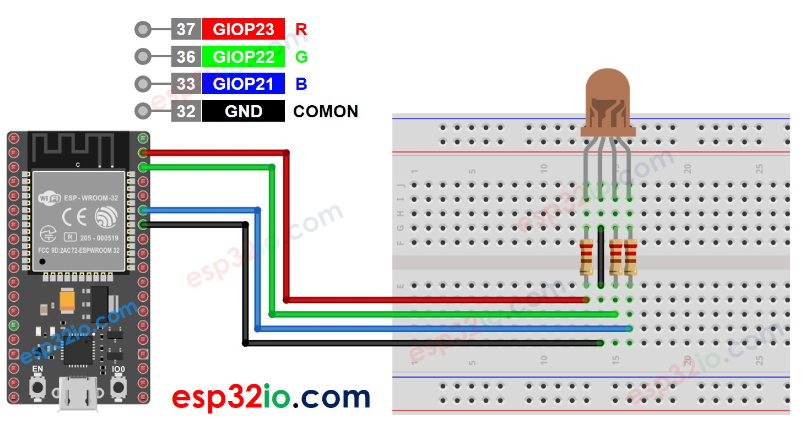

# Sensor RGB LED

RGB LED is a type of light emitting diode and its name derives from the words Red, Green and Blue, they commonly have four wires with a common terminal either a common anode or cathode RGB LED. From these three colors we can generate more than 16 million shades of light.

### Hardware Used In This Tutorial

- 1 x ESP-WROOM-32 Dev Module
- 1 x Micro USB Cable
- 1 x Breadboard
- 4 x Jumper Wires
- 1 x RGB LED Sensor
- 3 x 220 ohm resistor

### Wiring Diagram

### ESP32 Code

#include <analogWrite.h>

#define PIN_RED    23 // GIOP23
#define PIN_GREEN  22 // GIOP22
#define PIN_BLUE   21 // GIOP21

void setup() {
  pinMode(PIN_RED,   OUTPUT);
  pinMode(PIN_GREEN, OUTPUT);
  pinMode(PIN_BLUE,  OUTPUT);
}

void loop() {
  // color code #00C9CC (R = 0,   G = 201, B = 204)
  analogWrite(PIN_RED, 0);
  analogWrite(PIN_GREEN, 201);
  analogWrite(PIN_BLUE, 204);

  delay(1000); // keep the color 1 second

  // color code #F7788A (R = 247, G = 120, B = 138)
  analogWrite(PIN_RED,   247);
  analogWrite(PIN_GREEN, 120);
  analogWrite(PIN_BLUE,  138);

  delay(1000); // keep the color 1 second

  // color code #34A853 (R = 52,  G = 168, B = 83)
  analogWrite(PIN_RED,   52);
  analogWrite(PIN_GREEN, 168);
  analogWrite(PIN_BLUE,  83);

  delay(1000); // keep the color 1 second
}
